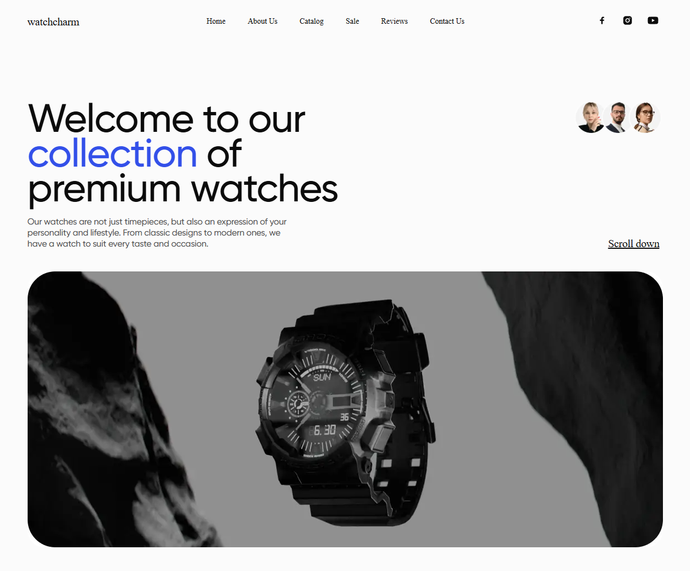
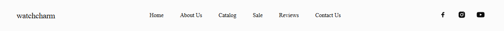
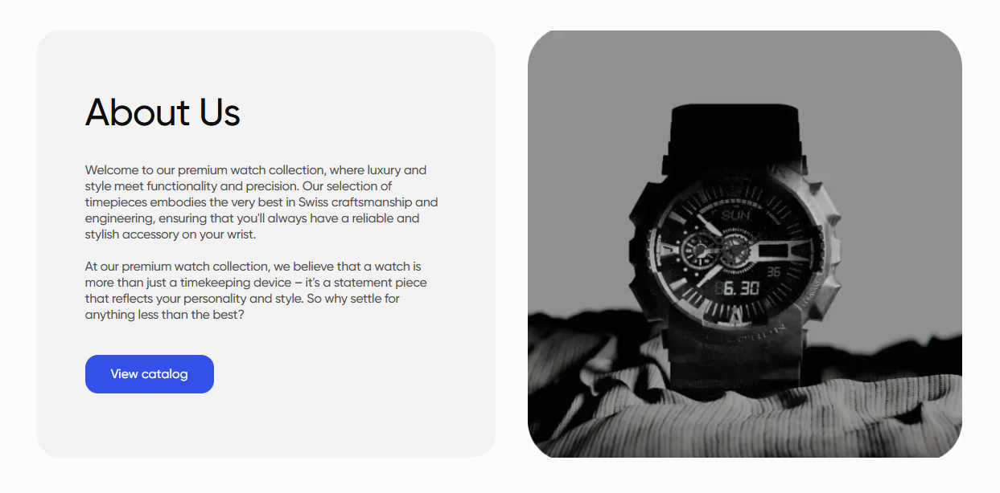
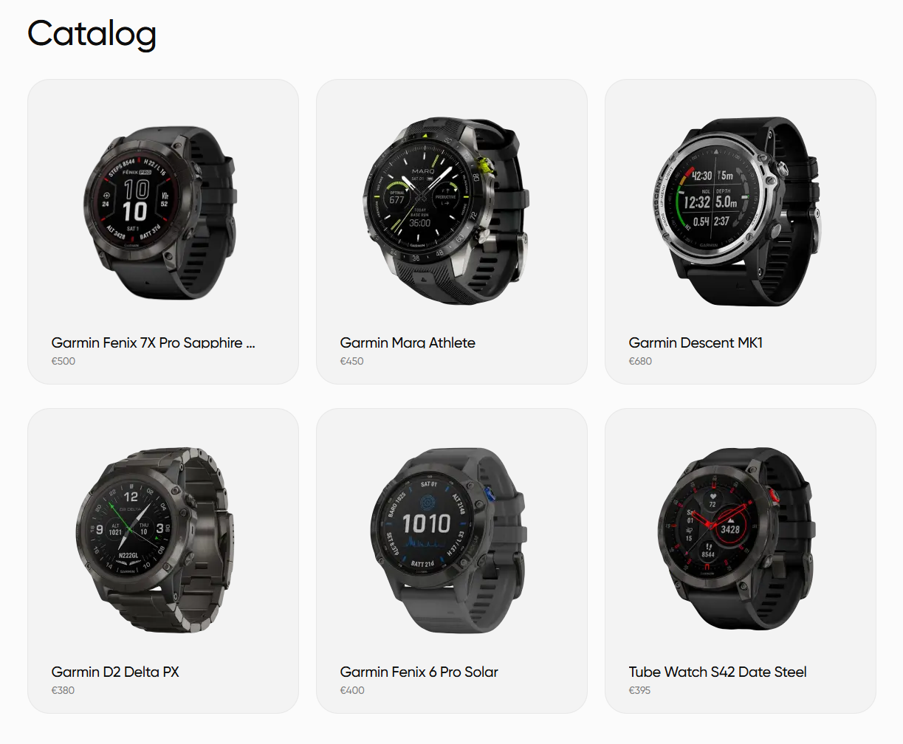
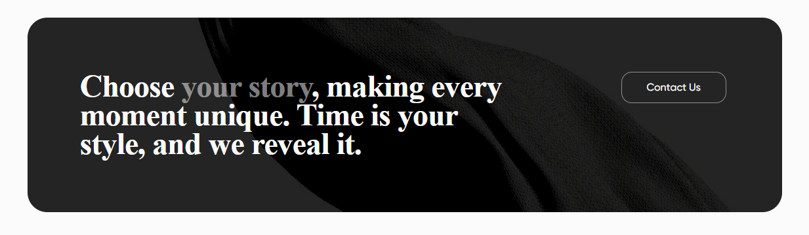
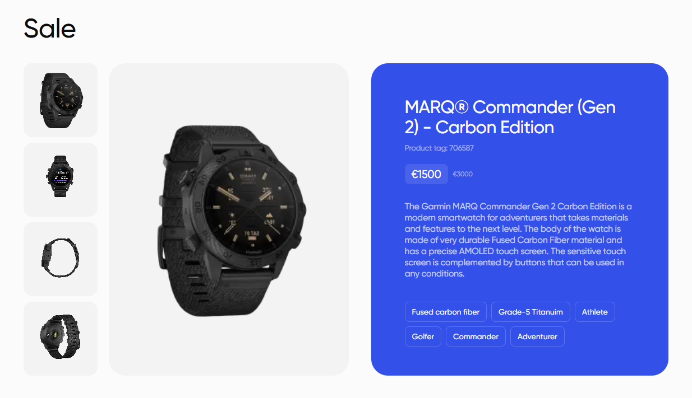
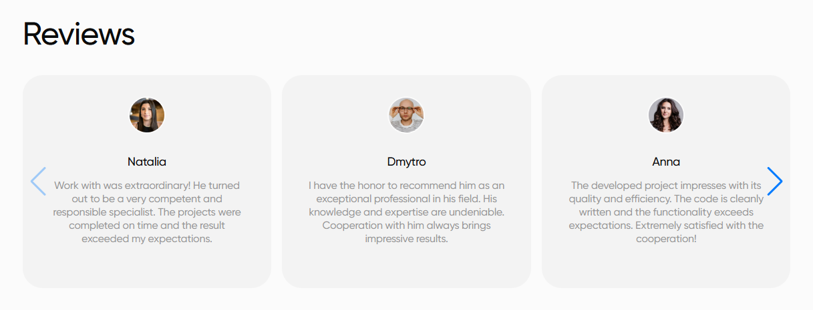
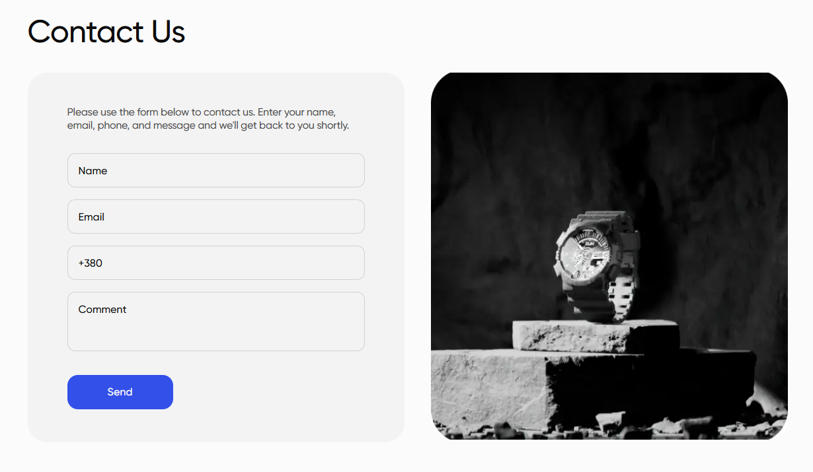
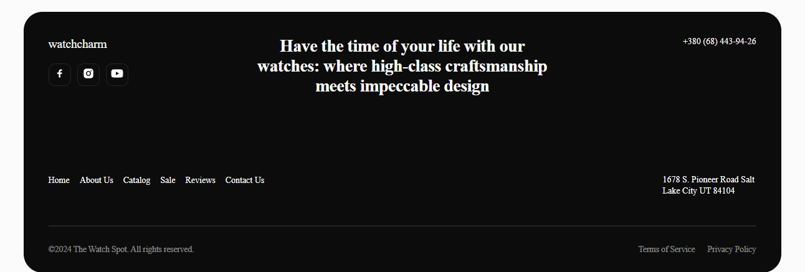

# Individual project: watch charm

### Description:

This project is a website designed to showcase a collection of wristwatches. The site aims to provide users with detailed information about each watch model, including images, features, prices and availability. Using modern technologies, the site provides a convenient and enjoyable user experience, as well as adaptability for various devices.

---

### Features:

1. **Interface:**

   - Modern and stylish design.
   - Easy to navigate: access to all watch models in a few clicks.
   - Detailed information about each model (photo, features, price, availability).

2. **Adaptive design:**

   - The site automatically adapts to different screen sizes, which allows users to comfortably view the site both on desktops and on mobile devices.

3. **Dynamic Content:**

   - Thanks to the use of React, the site downloads information about the watch dynamically, which allows you to maintain high speed without rebooting the page.

4. **Animations and Effects:**

   - The site contains smooth animations and effects when hovering over elements, which makes the user experience more intuitive and enjoyable.

---

### Stages of implementation:

1. **Interface design:**

   - Development of site layouts, selection of colors and fonts, creation of stylized clock cards and navigation elements.

2. **Testing:**

   - Testing the site on different devices and browsers to ensure compatibility and adaptability.

3. **Launch and support:**

   - Publication of the site on the Internet and subsequent update based on user feedback.

---

### Advantages of using:

- Easy access to complete information about the watch model.
- Quick access to details and prices without having to browse through numerous pages.
- Responsive design for easy viewing across devices.

---

### Technologies used:

1. **Programming languages:**

   - **JavaScript**

2. **Frameworks and Libraries:**

   - **React**

3. **Other technologies:**

   - **Git**

4. **Adaptability:**
   - **CSS Media Queries**
   - **Flexbox**
---

This site allows users to comfortably get acquainted with various models of wristwatches, filter them according to the necessary criteria and receive all the necessary information without unnecessary steps. Thanks to the adaptive design, the site is optimized for any device, which guarantees ease of use on smartphones, tablets and desktops.

